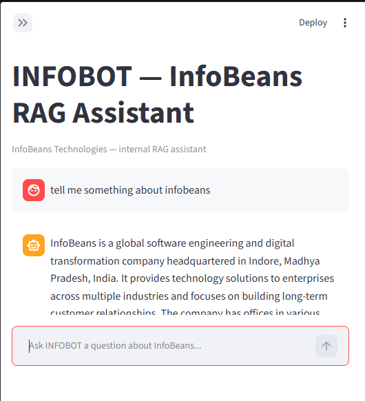

# INFOBOT — InfoBeans RAG Chatbot

A retrieval-augmented generation (RAG) chatbot that answers questions about InfoBeans Technologies by grounding an LLM's responses in a local FAISS index built from your own documents.

## Overview

Large language models don't know anything about your private documents, and asking them to answer from memory alone invites hallucination. This project solves that by:

1. Ingesting local documents (PDF, Word, Excel, CSV, TXT, JSON) from a `data/` folder.
2. Splitting them into overlapping text chunks and embedding each chunk locally (no external embedding API).
3. Storing those embeddings in a FAISS vector index on disk.
4. At query time, embedding the user's question, retrieving the most similar chunks, and passing them as context to a Groq-hosted LLM, which answers using only that retrieved context.
5. Serving the whole flow through a Streamlit chat UI with source citations, so answers stay traceable back to the original document, page, or row.

## Key Features

- **Multi-format ingestion**: PDF, TXT, CSV, XLSX, DOCX, and JSON files are all loaded recursively from `data/` ([src/data_loader.py](src/data_loader.py)).
- **Local embeddings, no external embedding API**: uses `sentence-transformers` (`all-MiniLM-L6-v2`) so document content never leaves the machine during embedding ([src/embedding.py](src/embedding.py)).
- **Persisted FAISS index**: exact L2 similarity search (`IndexFlatL2`) saved to `faiss_store/faiss.index` + `metadata.pkl`, so the index is built once and reloaded on subsequent runs ([src/vectorstore.py](src/vectorstore.py)).
- **Context-grounded answers with a refusal path**: the LLM prompt explicitly instructs the model to say so if the retrieved context doesn't contain the answer, and the app returns "No relevant documents found." when retrieval comes back empty ([src/search.py](src/search.py)).
- **Source citations in the UI**: every answer can be expanded to show the exact chunks used, their originating file, page/row number, and a heuristic relevance score ([streamlit_app.py](streamlit_app.py)).
- **Cumulative token usage tracking**: the sidebar sums Groq's `usage_metadata` (prompt/completion/total tokens) across the saved conversation.
- **Persisted chat history**: conversations survive app restarts via a local `chat_history.json` file.
- **Configurable retrieval depth**: a sidebar slider lets the user change `top_k` (1–10 chunks) per session without restarting the app.

## How It Works

```
data/ (PDF, TXT, CSV, XLSX, DOCX, JSON)
        │  src/data_loader.py  (langchain_community loaders)
        ▼
   raw LangChain Documents
        │  src/embedding.py  (RecursiveCharacterTextSplitter: chunk_size=1000, overlap=200)
        ▼
   text chunks
        │  src/embedding.py  (SentenceTransformer "all-MiniLM-L6-v2")
        ▼
   embeddings (float32 vectors)
        │  src/vectorstore.py  (FAISS IndexFlatL2 + pickled metadata)
        ▼
   faiss_store/ (faiss.index, metadata.pkl)          ← persisted on disk
        │
        │  ── at query time ──
        ▼
   user question → embedded → FAISS top-k search → matching chunks + metadata
        │  src/search.py  (RAGSearch: prompt built from retrieved context)
        ▼
   Groq LLM (ChatGroq, llama-3.1-8b-instant) → grounded answer
        │
        ▼
   streamlit_app.py → chat UI, source citations, token usage, persisted history
```

`app.py` is the ingestion/build entry point (run once, or whenever `data/` changes, to (re)build `faiss_store/`). `streamlit_app.py` is the actual user-facing chatbot and only ever *reads* from the index via `RAGSearch`.

## Tech Stack

| Component | Technology |
|---|---|
| Document loaders | `langchain-community` (`PyPDFLoader`, `TextLoader`, `CSVLoader`, `UnstructuredExcelLoader`, `Docx2txtLoader`, `JSONLoader`), `pypdf` |
| Chunking | `langchain-text-splitters` (`RecursiveCharacterTextSplitter`) |
| Embeddings | `sentence-transformers` (`all-MiniLM-L6-v2`, local, CPU) |
| Vector store | `faiss-cpu` (`IndexFlatL2`) + `pickle` for chunk metadata |
| LLM | Groq API via `langchain-groq` (`llama-3.1-8b-instant`) |
| Frontend | `streamlit` |
| Config/secrets | `python-dotenv` (`.env`) |
| Numerics | `numpy` |

## Project Structure

```
RAG chatbot IB/
├── app.py                    # Build/load the FAISS index from data/, then run one example query
├── main.py                   # Default uv-generated placeholder — not part of the RAG pipeline
├── streamlit_app.py          # Streamlit chat UI — the actual frontend
├── src/
│   ├── data_loader.py        # load_all_documents(): recursive multi-format loader for data/
│   ├── embedding.py          # EmbeddingPipeline: chunking + local sentence-transformer embeddings
│   ├── vectorstore.py        # FaissVectorStore: build / save / load / query the FAISS index
│   └── search.py             # RAGSearch: retrieval + Groq LLM prompting (answer/sources/usage)
├── notebook/
│   ├── document.ipynb        # Exploration: PyMuPDFLoader vs. pypdf PDF loading
│   └── pdfloader.ipynb       # Exploration: Chroma vector store prototype (not used in production)
├── data/                     # Source documents ingested by data_loader.py
│   ├── pdf/                  # e.g. InfoBeans overview, sample RAG test document
│   ├── text_files/           # e.g. machine_learning.txt, python_intro.txt
│   └── vector_store*/        # Leftover Chroma DBs from notebook experiments (unused by production code)
├── faiss_store/              # Generated: faiss.index + metadata.pkl (created by app.py)
├── chat_history.json         # Generated: persisted Streamlit conversation history (gitignored)
├── requirements.txt          # Verified, pinned runtime dependencies — source of truth for installs
├── requirements-dev.txt       # Dev-only deps (Jupyter/notebook tooling)
├── pyproject.toml            # uv project file — currently out of sync with real deps (see file's own notes)
├── .python-version           # Pins 3.14 (see Known Issues — actual verified venv is 3.11)
└── .env                       # GROQ_API_KEY (not committed; see .gitignore)
```

## Setup & Installation

**Prerequisites:** Python 3.11 (see [Known Issues](#limitations--known-issues) about the `.python-version` mismatch), a [Groq API key](https://console.groq.com).

```bash
# 1. Clone the repository
git clone <this-repo-url>
cd "RAG chatbot IB"

# 2. Create and activate a virtual environment
python -m venv .venv
.venv\Scripts\activate        # Windows
# source .venv/bin/activate   # macOS/Linux

# 3. Install runtime dependencies (requirements.txt is the verified, working set)
pip install -r requirements.txt
# Optional, only needed for notebook/*.ipynb:
pip install -r requirements-dev.txt

# 4. Configure secrets
echo GROQ_API_KEY=your_key_here > .env

# 5. Add documents to ingest (PDF/TXT/CSV/XLSX/DOCX/JSON) under data/
#    Two sample PDFs and two sample .txt files are already included.

# 6. Build the FAISS index (creates faiss_store/)
python app.py

# 7. Launch the chatbot
streamlit run streamlit_app.py
```

The Streamlit app will refuse to start with a clear on-screen error if `GROQ_API_KEY` is missing, or if `faiss_store/` doesn't exist yet (it will tell you to run `python app.py` first).

## Usage

Once running, ask questions in the chat box about whatever is in `data/`. Based on the sample documents shipped in this repo, example queries include:

| Example query | Expected response |
|---|---|
| "What is InfoBeans' location?" | A short answer synthesized from the InfoBeans overview PDF, with an expandable "View sources" section showing the exact PDF page(s) used. |
| "Summarize the InfoBeans overview document." | A concise summary grounded in the retrieved chunks from that PDF. |
| "What is machine learning?" | An answer drawn from `data/text_files/machine_learning.txt`. |
| A question with no matching content in `data/` | `"No relevant documents found."` — the app does not fall back to the model's own general knowledge. |

Each response shows:
- The generated answer.
- An expandable **View sources** panel with the source file name, page/row, a heuristic relevance percentage, and a text preview of each retrieved chunk.
- A running **token usage** total in the sidebar (prompt/completion/total tokens, summed across the saved session).

`` — 

## Configuration

### Environment variables (`.env`)

| Variable | Required | Purpose |
|---|---|---|
| `GROQ_API_KEY` | Yes | Groq API key used by `ChatGroq` in [src/search.py](src/search.py) to generate answers. Loaded via `python-dotenv`. Checked explicitly on startup in [streamlit_app.py](streamlit_app.py). |

No other environment variables are read anywhere in the codebase; there is no `.env.example` file, so `.env` must be created manually as shown above.

### Notable code-level constants (not env vars)

These are hardcoded defaults and would require a code change (not a config file) to alter:

| Constant | Location | Value |
|---|---|---|
| LLM model | `streamlit_app.py` (`LLM_MODEL`), `RAGSearch.__init__` default | `llama-3.1-8b-instant` |
| Embedding model | `EmbeddingPipeline`, `FaissVectorStore`, `RAGSearch` defaults | `all-MiniLM-L6-v2` |
| Chunk size / overlap | `EmbeddingPipeline.__init__` | 1000 chars / 200 overlap |
| FAISS persist directory | `FaissVectorStore.__init__` default | `faiss_store` |
| Default retrieved chunks | `streamlit_app.py` (`DEFAULT_TOP_K`) | 5 (user-adjustable 1–10 via sidebar) |
| Max query length | `streamlit_app.py` (`MAX_QUERY_CHARS`) | 1000 characters |

## Limitations / Known Issues

- **Cold-start bug**: if `RAGSearch` is instantiated directly (not via `app.py` first) with no existing `faiss_store/` index, it hits `from data_loader import load_all_documents` in [src/search.py:15](src/search.py#L15), which is missing the `src.` prefix and raises `ModuleNotFoundError`. `streamlit_app.py` catches this specific case and shows a friendly message telling the user to run `python app.py` first, but the underlying import is still broken. The same missing-prefix bug exists in the `__main__` block of [src/vectorstore.py:71](src/vectorstore.py#L71).
- **Dependency metadata is out of sync**: `pyproject.toml` / `uv.lock` are missing several packages the code actually imports (`faiss-cpu`, `sentence-transformers`, `langchain-groq`, etc. — see comments in `pyproject.toml`). `requirements.txt` is the verified, working dependency set; don't rely on `uv sync`/`uv.lock` until this is reconciled.
- **Python version mismatch**: `.python-version` pins `3.14`, but the dependency set in `requirements.txt` was verified against a Python 3.11 virtual environment (per its header comment). Use 3.11 until this is reconciled.
- **Exact (brute-force) vector search**: FAISS `IndexFlatL2` computes exact nearest neighbors with no approximate index (e.g. IVF/HNSW), which is fine for small document sets but won't scale to large corpora.
- **Heuristic relevance score, not a calibrated probability**: the UI's "relevance" percentage is `1 / (1 + distance)` — a monotonic display cue only, explicitly documented as such in the code.
- **Token usage is not a quota indicator**: the sidebar's token counter is a running sum of past usage from local history, not a live check against Groq's actual account limits (Groq's API doesn't expose that).
- **No automated tests**: there is no test suite in the repository.
- **No authentication**: the Streamlit app has no login/access control; anyone who can reach the running app can query it and consume the configured Groq API key's quota.
- **Leftover artifacts in `data/`**: `data/vector_store*/` directories contain Chroma sqlite files from notebook prototyping; they are not read by any production code path (only PDF/TXT/CSV/XLSX/DOCX/JSON are globbed).

## Roadmap / Future Improvements

- Fix the `src.data_loader` / `src.vectorstore` import bugs so a true cold start (no existing index, instantiating `RAGSearch` directly) works without relying on `app.py` running first.
- Reconcile `pyproject.toml` and `uv.lock` with the actual dependencies in `requirements.txt`, and align `.python-version` with the verified runtime.
- Swap `IndexFlatL2` for an approximate index (e.g. IVF or HNSW) if the document corpus grows significantly.
- Add an automated test suite (loader parsing, chunking boundaries, retrieval ranking).
- Add basic authentication in front of the Streamlit app before any shared/public deployment.
- Clean up or gitignore the leftover Chroma artifacts under `data/`.

## License

No license file is currently included in this repository. All rights reserved by default until a license is added — add a `LICENSE` file (e.g. MIT, Apache-2.0) to make reuse terms explicit.
