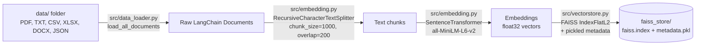
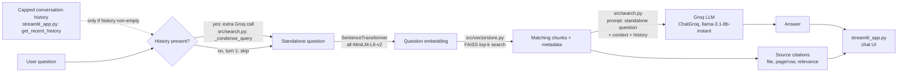
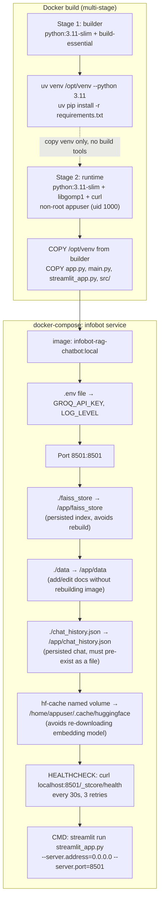

# Architecture

## System overview

INFOBOT is a retrieval-augmented generation (RAG) pipeline with two distinct phases: an offline **ingestion/build** phase that turns local documents into a persisted FAISS vector index, and a live **query** phase that embeds a user's question, retrieves the most similar chunks from that index, and passes them to a Groq-hosted LLM to generate a grounded answer. Both phases share the same embedding model and vector store code (`src/vectorstore.py`, `src/embedding.py`) so retrieval at query time is always comparable to what was indexed at build time. The whole app ships as a single Docker container running the Streamlit UI.

## Pipeline: document ingestion → chunking → embedding → vector storage

Triggered by running `app.py` (or automatically by `RAGSearch.__init__` if `faiss_store/` doesn't exist yet — see the cold-start note below).

## Pipeline: live query path

Query handling is a condense (skipped on turn 1) → retrieve → generate pipeline, not a single retrieval step. `RAGSearch.search_and_summarize_with_sources()` ([src/search.py:134](../src/search.py#L134)) takes an optional `history` argument (capped, stripped conversation turns from `streamlit_app.py`'s `get_recent_history()`, [streamlit_app.py:217](../streamlit_app.py#L217)). When history is present, `_condense_query()` ([src/search.py:52](../src/search.py#L52)) makes an extra Groq call to rewrite the raw follow-up (e.g. "What does it do?") into a standalone question before it's used for retrieval; that resolved question, not the raw one, is also what goes into the final answer prompt alongside the history, since feeding the small 8B model both pronoun resolution and grounding compliance in the same call destabilized answers in testing. This means **follow-up queries make two LLM calls instead of one** — a latency/cost tradeoff accepted to keep multi-turn questions grounded in the right retrieved chunks. See [05-TROUBLESHOOTING.md](05-TROUBLESHOOTING.md#conversational-memory) for the symptom this fixed.

If retrieval returns no chunks (empty `data/`, or a question with no matching content), `src/search.py` short-circuits and returns `"No relevant documents found."` without calling the LLM at all — the app never falls back to the model's own general knowledge.

**No API layer between UI and pipeline.** The diagram above happens entirely within one Python process: `streamlit_app.py` calls `RAGSearch.search_and_summarize_with_sources()` in `src/search.py` as a direct in-process function call, not an HTTP request — now passing `history` as well as `query` and `top_k`. See [README.md § How Data Flows: Frontend to Backend (No API Layer)](../README.md#how-data-flows-frontend-to-backend-no-api-layer) for the exact function signature, inputs/outputs, and step-by-step call path.

## Deployment / container setup

## Component table

| Component | Responsibility | Key file(s) |
|---|---|---|
| Ingestion entry point | Build/load the FAISS index from `data/`, run one example query | [app.py](../app.py) |
| Document loading | Recursively find and parse PDF/TXT/CSV/XLSX/DOCX/JSON from `data/`; one bad file logs and is skipped, not fatal | [src/data_loader.py](../src/data_loader.py) |
| Chunking + embedding | Split documents into overlapping text chunks, encode each chunk locally | [src/embedding.py](../src/embedding.py) |
| Vector storage | Build/save/load/query the FAISS index and its chunk metadata | [src/vectorstore.py](../src/vectorstore.py) |
| Retrieval + generation | Embed the question, retrieve top-k chunks, prompt the Groq LLM, return answer + sources + token usage | [src/search.py](../src/search.py) |
| Logging | Shared console + rotating-file logging config used by every module | [src/logger.py](../src/logger.py) |
| Chat frontend | Streamlit UI: chat input, source citations, token usage, persisted history, sidebar controls | [streamlit_app.py](../streamlit_app.py) |
| Containerization | Multi-stage Docker build and Compose service definition | [Dockerfile](../Dockerfile), [docker-compose.yml](../docker-compose.yml) |

## Known limitations

- **Single-container design.** The Streamlit UI, retrieval logic, and the call to the Groq LLM all run in one process inside one container. This is an intentional current-stage choice — it keeps the demo simple to build, run, and hand off — not an oversight. Splitting this into a separate backend API (retrieval + LLM) and a thin frontend is a natural next step once there's a need for independent scaling, multiple frontends, or multiple concurrent users.
- **Single-user assumption.** There's no session isolation or authentication; the app assumes one person using it at a time on one machine/container.
- **Exact (brute-force) vector search.** FAISS `IndexFlatL2` computes exact nearest neighbors with no approximate index (e.g. IVF/HNSW) — fine for the shipped document set, won't scale to a large corpus without a change.
- **Cold-start import bug.** If `RAGSearch` is instantiated directly with no existing `faiss_store/` index, it hits `from data_loader import load_all_documents` in [src/search.py:20](../src/search.py#L20) (missing the `src.` prefix), raising `ModuleNotFoundError`. `streamlit_app.py` catches this specific case and shows a friendly message telling the user to run `python app.py` first, but the underlying import is still broken. The same missing-prefix bug exists in the `__main__` block of [src/vectorstore.py:78](../src/vectorstore.py#L78).
- **Dependency metadata out of sync.** `pyproject.toml`/`uv.lock` are missing several packages the code actually imports (`faiss-cpu`, `sentence-transformers`, `langchain-groq`, etc.). `requirements.txt` is the verified, working dependency set — don't rely on `uv sync`/`uv.lock` until this is reconciled (see [03-TECH_STACK.md](03-TECH_STACK.md)).
- **Python version mismatch.** `.python-version` pins `3.14`, but `requirements.txt` was verified against Python 3.11, and the Docker image explicitly builds on `python:3.11-slim`. Use 3.11 for a manual (non-Docker) setup.
- **Leftover artifacts in `data/`.** `data/vector_store*/` directories are Chroma sqlite files from notebook prototyping; no production code path reads them (only PDF/TXT/CSV/XLSX/DOCX/JSON are globbed).
